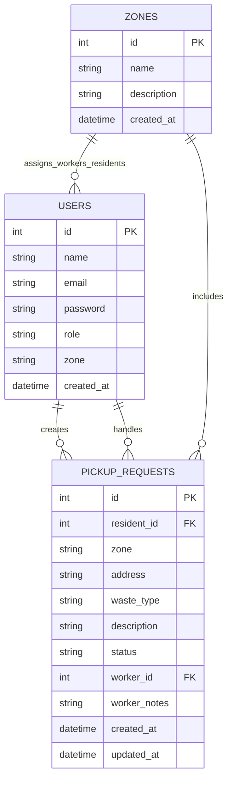

# 🌱 Neighbourhood Waste Pickup Request Portal

> SE ZG503 Full Stack Application Development Assignment  
> **Stack:** React + Node.js + SQLite  

---

## Problem Statement

Residents in a neighbourhood need an easy way to raise waste pickup requests. Municipal workers need to manage and mark pickups complete. The admin needs to track request status across zones.

---

## Architecture

```
┌─────────────────────┐        REST API        ┌─────────────────────┐
│   React Frontend    │ ──── HTTP/JSON ────►   │  Node.js + Express  │
│   (port 3000)       │ ◄────────────────────  │  (port 5000)        │
└─────────────────────┘                        └─────────┬───────────┘
                                                         │
                                                    ┌────▼────┐
                                                    │ SQLite  │
                                                    │   DB    │
                                                    └─────────┘
```

---

## Setup & Run

### Prerequisites
- Node.js 18+ (validated on Node 24 as well)
- npm

### Backend
```bash
cd backend
npm install
copy .env.example .env
npm run seed      # Populate demo data
npm run dev       # Starts on http://localhost:5000
```

### Frontend
```bash
cd frontend
npm install
npm start         # Starts on http://localhost:3000
```

### Demo Credentials
| Role     | Email                  | Password    |
|----------|------------------------|-------------|
| Admin    | admin@waste.com        | password123 |
| Worker   | worker1@waste.com      | password123 |
| Resident | resident1@waste.com    | password123 |

---

## Database Schema

### `users`
| Column     | Type    | Description                        |
|------------|---------|------------------------------------|
| id         | INTEGER | Primary key                        |
| name       | TEXT    | Full name                          |
| email      | TEXT    | Unique email                       |
| password   | TEXT    | bcrypt hashed                      |
| role       | TEXT    | resident / worker / admin          |
| zone       | TEXT    | Assigned zone (nullable for admin) |

### `pickup_requests`
| Column       | Type    | Description                              |
|--------------|---------|------------------------------------------|
| id           | INTEGER | Primary key                              |
| resident_id  | INTEGER | FK → users                               |
| zone         | TEXT    | Zone name                                |
| address      | TEXT    | Pickup address                           |
| waste_type   | TEXT    | general / recyclable / hazardous / bulky |
| description  | TEXT    | Optional details                         |
| status       | TEXT    | pending / assigned / completed / rejected|
| worker_id    | INTEGER | FK → users (assigned worker)             |
| worker_notes | TEXT    | Worker's completion notes                |

### `zones`
| Column      | Type    | Description          |
|-------------|---------|----------------------|
| id          | INTEGER | Primary key          |
| name        | TEXT    | Unique zone name     |
| description | TEXT    | Zone details         |

---

## ER Diagram (Model View)



---

## API Documentation

### Auth
| Method | Endpoint           | Body                              | Auth | Description   |
|--------|--------------------|-----------------------------------|------|---------------|
| POST   | /api/auth/register | name, email, password, role, zone | ❌   | Register user |
| POST   | /api/auth/login    | email, password                   | ❌   | Get JWT token |

### Pickup Requests
| Method | Endpoint                     | Auth     | Role          | Description                 |
|--------|------------------------------|----------|---------------|-----------------------------|
| GET    | /api/requests                | ✅ JWT   | Any           | List requests (role-scoped) |
| GET    | /api/requests/:id            | ✅ JWT   | Any           | Get single request          |
| POST   | /api/requests                | ✅ JWT   | Resident      | Create request              |
| PATCH  | /api/requests/:id/status     | ✅ JWT   | Worker, Admin | Update status               |
| DELETE | /api/requests/:id            | ✅ JWT   | Resident/Admin| Cancel/delete request       |

### Zones
| Method | Endpoint          | Auth     | Role  | Description         |
|--------|-------------------|----------|-------|---------------------|
| GET    | /api/zones        | ✅ JWT   | Any   | List zones          |
| POST   | /api/zones        | ✅ JWT   | Admin | Create zone         |
| GET    | /api/zones/stats  | ✅ JWT   | Admin | Zone stats          |
| GET    | /api/zones/workers| ✅ JWT   | Admin | List workers        |

---

## Component Hierarchy

```
App
├── AuthProvider (context)
├── Navbar
├── Login
├── Register
├── ResidentDashboard
│   └── New Request Form
├── WorkerDashboard
│   └── Request Cards with status actions
└── AdminDashboard
    ├── Overall Stats
    ├── Zone Breakdown Table
    ├── Workers List
    └── All Requests Table (filterable)
```

---

## AI Usage

This project was developed with assistance from Claude (claude.ai).  
See `AI_USAGE_LOG.md` for detailed prompts and reflection.

---

## Notes

This implementation follows a modular backend in a single Node.js service (`auth`, `requests`, and `zones` route modules), with clear service boundaries.

Microservice-aligned boundaries are defined as:
1. `auth` service domain - user identity, JWT issuing, login/register
2. `requests` service domain - request lifecycle CRUD and role-scoped access
3. `zones` service domain - zone administration and operational analytics

To address microservice expectations explicitly, the current codebase is designed with stable domain contracts that can be deployed independently without frontend changes:

| Service Domain | Current Route Prefix | Planned Service Base URL |
|---|---|---|
| Auth Service | `/api/auth` | `/auth-service` |
| Requests Service | `/api/requests` | `/requests-service` |
| Zones Service | `/api/zones` | `/zones-service` |

---

## Assumptions

1. SQLite is used for simplicity; the schema is easily portable to PostgreSQL.
2. Residents are pre-assigned to a zone on registration; the admin can manage zone assignments.
3. Workers see only open requests (pending/assigned) from their zone; completed ones are archived.
4. JWT tokens expire in 7 days.
