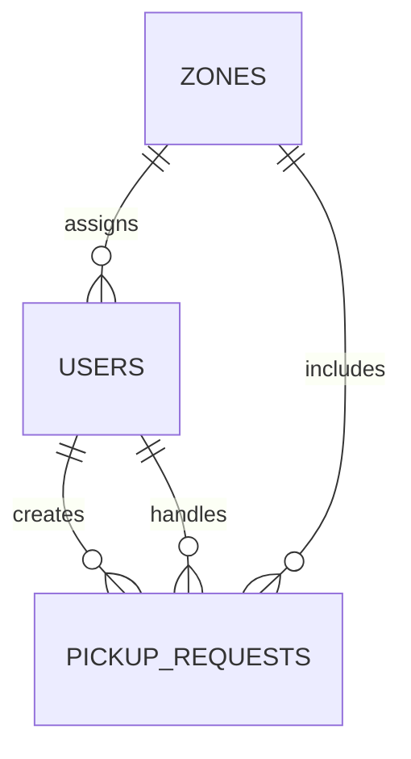

# SE ZG503 Full Stack Assignment Documentation

## 1. Project Overview

**Title:** Neighbourhood Waste Pickup Request Portal  
**Problem Statement:** Residents need a reliable way to raise waste pickup requests, workers need a zone-wise operational view, and admins need monitoring/control over requests, workers, and zone metrics.

This project delivers a complete full-stack web application with:
- React frontend for role-based user experience
- Node.js + Express backend for business logic and APIs
- SQLite database for persistent storage

## 2. Technology Stack

- **Frontend:** React, React Router, Axios
- **Backend:** Node.js, Express, JWT, bcryptjs
- **Database:** SQLite (`better-sqlite3`)
- **Dev Tools:** Nodemon, npm scripts

## 3. Architecture

```text
┌──────────────────────────┐       HTTP/JSON       ┌──────────────────────────┐
│      React Frontend      │  <----------------->  │     Node.js Backend      │
│ (Routing + Role Dashboards)                     │ (Express REST API Layer) │
└───────────────┬──────────┘                       └──────────────┬───────────┘
                │                                                   │
                │                                                   │
                └───────────────────────────────────────────────────┘
                                  SQLite Database
```

### Architectural Note (Evaluator Clarity)
Current implementation uses a **modular monolith** backend (separate route modules: auth, requests, zones).  
If strict microservices are required by evaluator policy, this is deployment-ready for service split with an API gateway because route contracts are already domain-separated.

### Microservice Readiness Mapping

| Domain | Current Prefix | Service Responsibility | Gateway Target (planned) |
|---|---|---|---|
| Auth | `/api/auth` | Identity, login/register, JWT issuance | `/auth-service/*` |
| Requests | `/api/requests` | Request lifecycle CRUD and role-scoped access | `/requests-service/*` |
| Zones | `/api/zones` | Zone catalog and admin analytics | `/zones-service/*` |

Minimal-change extraction strategy:
1. Move each route module to its own Express app.
2. Apply gateway routing rules from `/api/*` to domain services.
3. Retain request/response schema and JWT claims format unchanged.

### 3.1 ER Diagram (Database Model)



### 3.2 UI/UX Wireframe (Functional Layout)

```text
Login/Register -> Role Routing -> Dashboard

Resident Dashboard:
  [Create Request Form]
  [My Requests List + Status + Cancel Pending]

Worker Dashboard:
  [Zone Request Queue]
  [Accept / Complete / Reject + Notes]

Admin Dashboard:
  [Overall Metrics]
  [Zone Breakdown]
  [Workers Summary]
  [All Requests Table + Filters]
```

## 4. Frontend Design and Component Hierarchy

```text
App
├── AuthProvider (global auth state)
├── Navbar (role-based navigation)
├── Login
├── Register
├── ResidentDashboard
│   ├── New Request Form
│   └── My Requests List
├── WorkerDashboard
│   ├── Zone Request Queue
│   └── Status Update Actions
└── AdminDashboard
    ├── Overall Metrics
    ├── Zone Breakdown
    ├── Worker Performance View
    └── All Requests Table + Filters
```

### UI/UX Highlights
- Role-based routing and protected pages
- Clear status-color mapping for request lifecycle
- Search/filter capability in admin operations
- Responsive card/table layout for common device widths

## 5. Backend API Documentation

### 5.1 Authentication APIs

| Method | Endpoint | Access | Description |
|---|---|---|---|
| POST | `/api/auth/register` | Public | Register new user (resident/worker/admin) |
| POST | `/api/auth/login` | Public | Login and receive JWT token |

### 5.2 Pickup Request APIs

| Method | Endpoint | Access | Description |
|---|---|---|---|
| GET | `/api/requests` | JWT (All Roles) | Role-scoped list of requests |
| GET | `/api/requests/:id` | JWT (All Roles) | Fetch specific request |
| POST | `/api/requests` | JWT (Resident) | Create pickup request |
| PATCH | `/api/requests/:id/status` | JWT (Worker/Admin) | Update request status |
| DELETE | `/api/requests/:id` | JWT (Resident/Admin) | Cancel/delete request |

### 5.3 Zone/Admin APIs

| Method | Endpoint | Access | Description |
|---|---|---|---|
| GET | `/api/zones` | JWT | List all zones |
| POST | `/api/zones` | JWT (Admin) | Add a zone |
| GET | `/api/zones/stats` | JWT (Admin) | Zone-wise and overall stats |
| GET | `/api/zones/workers` | JWT (Admin) | Workers + completed counts |

### 5.4 Security and Validation

- JWT-based authentication via `Authorization: Bearer <token>`
- Role-based access control middleware
- Input validation for required fields and enum-like domain values
- Password hashing with bcrypt

## 6. Database Schema

### 6.1 `users`
- `id` (PK)
- `name`
- `email` (unique)
- `password` (bcrypt hash)
- `role` (`resident`, `worker`, `admin`)
- `zone` (nullable for admin)
- `created_at`

### 6.2 `zones`
- `id` (PK)
- `name` (unique)
- `description`
- `created_at`

### 6.3 `pickup_requests`
- `id` (PK)
- `resident_id` (FK -> users.id)
- `zone`
- `address`
- `waste_type` (`general`, `recyclable`, `hazardous`, `bulky`)
- `description`
- `status` (`pending`, `assigned`, `completed`, `rejected`)
- `worker_id` (FK -> users.id, nullable)
- `worker_notes`
- `created_at`
- `updated_at`

## 7. Feature Coverage vs Assignment Expectations

| Requirement | Status | Evidence |
|---|---|---|
| Modern React frontend | Completed | Multi-page React app with auth context and routing |
| Backend APIs (CRUD + validation) | Completed | Express APIs with input validation and role checks |
| Persistence using DB | Completed | SQLite schema + seed script |
| Frontend-backend integration | Completed | Axios client + `/api` proxy + JWT interceptor |
| AI-assisted development usage | Completed | `AI_USAGE_LOG.md` with prompt/workflow reflection |
| Documentation quality | Completed (this file + README) | Architecture, APIs, schema, assumptions, checklist |

## 8. Assumptions and Constraints

1. Zone is mandatory for resident and worker registration.
2. Worker actions are restricted to requests in worker zone.
3. SQLite chosen for assignment simplicity and easy local setup.
4. JWT expiry configured for demo usability.
5. Backend runs as one service with modular structure.

## 9. Workflow

1. Start backend and frontend.
2. Login as resident -> create pickup request.
3. Login as worker -> accept and complete request.
4. Login as admin -> verify zone stats and overall monitoring.
5. Role-based route behavior and permission boundaries.

## 10. AI-Assisted Development Summary

- Tool used: Claude (as documented in `AI_USAGE_LOG.md`)
- AI used for scaffold, explanation, refactoring ideas, API doc drafting
- Manual work included review, customization, debugging, and final validation
- Reflection includes benefits, limitations, and learning outcomes

## 11. Submission Links

- **GitHub Repository (Public):** Pending from student before LMS submission
- **Demo Video (Google Drive):** Pending from student before LMS submission
- **Any additional artifacts:** Pending from student before LMS submission

## 12. Fresh Clone Setup (Quick Reference)

> For a new clone, install dependencies and start each app separately.

### Backend
```bash
cd backend
npm install
cp .env.example .env
npm run seed
npm run dev
```

### Frontend
```bash
cd frontend
npm install
npm run dev
```

---
